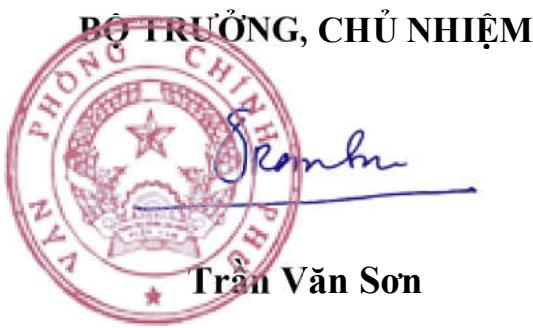

Hà Nội, ngày 13 tháng 9 năm 2019

# THÔNG BÁO

# Kết luận của Phó Thủ tướng Chính tại cuộc họp về dự thảo Luật Xây

Ngày 12 tháng 9 năm 2025, tại T Trần Hồng Hà chu trì cuộc họp về cuộc họp có bộ trương bộ xây bộ, cơ quan: Xây dựng, Tư pháp Nông nghiệp và môi trường, Kho Chính phủ, Văn phòng Chính p Hải Phòng, Liên đoàn Thương mã Xây dựng việt nam, hiệp hội Xây dựng báo cáo, ý kiến phát biểu của có Chính phu Trần Hồng Hà két l

Dánh giá cao tinh thần trách nhiện phối hợp với các bộ, cơ quan và các (thay thế); đánh giá cao các bộ, Luật và có ý kiến phát biểu cụ tl

Luật Xây dựng có phạm vi diều ch ngành, dia phương, do dó, để tiếp tục trước khi trinh Chinh phủ, Quốc phát biểu của các đại biểu tại cuốc tiếp tục rà soát để hoàn thiện dự

- Rà soát, thế chếc hóa đây đủ các chủ trung dựng pháp luật, bảo đám phù hợp về cấp. Tập trung giải quyết, khắc p tác đầu tư xây dựng trong thời gian thuận lợi, thông thoáng, minh bạch dơn gián hóa thu tục hành chính trong h

2. Rà soát kỹ dự thảo Luật bảo đám luật Trường hợp phát hiện chồng với quy định tại Luật này có thể chia tổng mức đầu tư của dụ án thành phố

3. Rà soát, chi quy định các chính Bộ trường quy định các nội dung ứng dụng công nghệ thông tin điều kiện năng lực, quy hoạch, quy

4. Rà soát quy trình, trình tự, thù ứng yêu cầu quân lý, baoo đám các chữa cháy, môi trường, đất dai và ứng các điều kiện như: công $\mathbf { k } \acute { \hat { \mathbf { e } } } .$ hình thức đăng ký xây dựng, công ke mau theo quy hoạch, có thể thay học

5 - Rà soát các quy dịnh chi tiết về các c như: chủ đầu tư, các đơn vị tư vấn thiến và cơ chế bảo vệ quyền các bên quy định về tổ chức thực hiện dự linh hoạt trong công tác lựa chọn quản lý dự án, tư vấn thẩm tran t

6. Nghiên cứu bỏ sung cơ chế để khuyến dụng khoa học công nghệ dễ các có sạch, chuyển dồi số, thong mi ngày 22 tháng 12 năm 2024 của

7. Tờ trình, báo cáo cần phân định thảo Luật, như: (1) sửa đổi để phù (11) sửa dôi để cát giám, dơn giản hóa chính sách; (iv) nội dung cát gia

8. Ra soát kỹ các quy định chuyển tiên vướng mắc khi Luật có hiệu lực

Văn phòng Chính phủ thông báo dề thực hiện./

# Nơi nhận

Thủ tướng, PTTg Trần Hồng Hà (để b/   
- Các Bộ XD, TP, QP, CA, CT,   
NEMT, KHẤCN, NV, NG,   
- Thanh tra chính phủ;   
UBND các thành phố: hà nội, hải   
- Liên đoàn tương mại và công - Hiệp hội các nhà thầu xây dựng   
Hiệp hội Tư vấn Xây dựng Việt   
- VPCP: BTCN, PCN Nguyễn Sỹ   
Các Vụ, Cục: TH, NN, PL, KSTT   
- Lư VT, CN (2b). Hop

