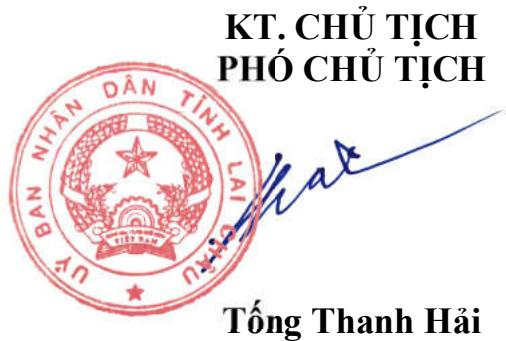
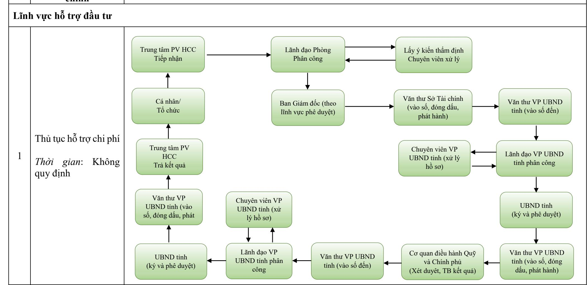

# CỘNG HOÀ XÃ HỘI CHỦ NGHĨA VIỆT NAM Độc lập - Tự do - Hạnh phúc

Số: /QĐ-UBND

Lai Châu, ngày tháng năm 2025

# QUYẾT ĐỊNH

Về việc công bố danh mục thủ tục hành chính mới ban hành và phê duyệt quy trình nội bộ giải quyết thủ tục hành chính trong lĩnh vực hỗ trợ đầu tư thuộc phạm vi chức năng quản lý của Sở Tài chính tỉnh Lai Châu

CHỦ TỊCH ỦY BAN NHÂN DÂN TỈNH LAI CHÂU

Căn cứ Luật Tổ chức chính quyền địa phương ngày 16/6/2025;

Căn cứ Nghị định số 63/2010/NĐ-CP ngày 08/6/20210 của Chính phủ về kiểm soát thủ tục hành chính; Nghị định số 92/2017/NĐ-CP ngày 07/8/2017 của Chính phủ sửa đổi, bổ sung một số điều của các Nghị định liên quan đến kiểm soát thủ tục hành chính;

Căn cứ Nghị định số 45/2020/NĐ-CP ngày 08 tháng 4 năm 2020 của Chính phủ về thực hiện thủ tục hành chính trên môi trường điện tử;

Căn cứ Nghị định số 42/2022/NĐ-CP ngày 24 tháng 6 năm 2022 của Chính phủ quy định về việc cung cấp thông tin và dịch vụ công trực tuyến của cơ quan nhà nước trên môi trường mạng;

Căn cứ Nghị định số 118/2025/NĐ-CP ngày 09 tháng 6 năm 2025 của Chính phủ về thực hiện thủ tục hành chính theo cơ chế một cửa, một cửa liên thông tại Bộ phận Một cửa và Cổng Dịch vụ công quốc gia;

Căn cứ Nghị định số 230/2025/NĐ-CP ngày 19/8/2025 của Chính phủ quy định các trường hợp khác được miễn, giảm tiền sử dụng đất, tiền thuê đất theo quy định tại khoản 2 Điều 157 Luật Đất đai năm 2024;

Căn cứ Thông tư số 02/2017/TT-VPCP ngày 31/10/2017 của Văn phòng Chính phủ hướng dẫn về nghiệp vụ kiểm soát thủ tục hành chính; Thông tư số 01/2018/TT-VPCP ngày 23/11/2018 của Văn phòng Chính phủ về hướng dẫn thi hành một số quy định của Nghị định số 61/2018/NĐ-CP ngày 23/4/2018 của Chính phủ về thực hiện cơ chế một cửa, một cửa liên thông trong giải quyết thủ tục hành chính;

Căn cứ Quyết định số 3083/QĐ-BTC ngày 04/9/2025 của Bộ Tài chính về việc công bố thủ tục hành chính mới ban hành trong lĩnh vực hỗ trợ đầu tư thuộc phạm vi chức năng quản lý của Bộ Tài chính;

Theo đề nghị của Giám đốc Sở Tài chính tại Tờ trình số 326/TTr-STC ngày 09/9/2025.

# QUYẾT ĐỊNH:

Điều 1. Công bố kèm theo Quyết định này 01 danh mục thủ tục hành chính mới ban hành và phê duyệt quy trình nội bộ giải quyết thủ tục hành chính trong lĩnh vực hỗ trợ đầu tư thuộc phạm vi chức năng quản lý của Sở Tài chính tỉnh Lai Châu.

(Có Phụ lục I, II chi tiết kèm theo)

Điều 2. Quyết định này có hiệu lực thi hành $\mathrm { k } \mathring { \mathrm { e } }$ từ ngày ký.

Giao Văn phòng UBND tỉnh chủ trì, phối hợp với Sở Tài chính và các cơ quan, đơn vị có liên quan căn cứ quy trình ban hành kèm theo Quyết định này thiết lập, tin học hóa quy trình giải quyết thủ tục hành chính trên $\mathrm { H } \hat { \mathrm { e } }$ thống thông tin giải quyết thủ tục hành chính tỉnh.

Điều 3. Chánh Văn phòng Ủy ban nhân dân tỉnh, Giám đốc Sở Tài chính; Chủ tịch UBND các xã, phường; Giám đốc Trung tâm Phục vụ hành chính công cấp tỉnh, cấp xã; Thủ trưởng các cơ quan, đơn vị và tổ chức, cá nhân có liên quan chịu trách nhiệm thi hành Quyết định này./.

# Nơi nhận:

- Như Điều 3;   
- Cục KSTTHC - VPCP;   
- Chủ tịch UBND tỉnh $( \mathsf { b } / \mathsf { c } )$ ;   
- VP UBND tỉnh: V1, V4, CB;   
- VNPT Lai Châu (p/h);   
- Lưu: VT, Hcc6.

Phụ lục I DANH MỤC THỦ TỤC HÀNH CHÍNH MỚI BAN HÀNH TRONG LĨNH VỰC HỖ TRỢ ĐẦU TƯ THUỘC PHẠM VI CHỨC NĂNG QUẢN LÝ CỦA SỞ TÀI CHÍNH TỈNH LAI CHÂU (Ban hành kèm theo Quyết định số: QĐ-UBND ngày tháng 9 năm 2025 của Chủ tịch UBND tỉnh Lai Châu)   

<table><tr><td rowspan=2 colspan=1>STT</td><td rowspan=2 colspan=1>Tên TTHC</td><td rowspan=2 colspan=1>Thời hạn giải quyết</td><td rowspan=2 colspan=1>Địa địa diểm, thời gian, cách thứchiện TTHC</td><td rowspan=2 colspan=1>Phí,lệ phí</td><td rowspan=2 colspan=1>Căn cứ pháp lý</td></tr><tr></tr><tr><td rowspan=1 colspan=1>A</td><td rowspan=1 colspan=5>THỦ TỤC HÀNH CHÍNH MỚI</td></tr><tr><td rowspan=1 colspan=1>THỦ</td><td rowspan=1 colspan=4>THỦ TỤC HÀNH CHÍNH CÁP</td><td rowspan=1 colspan=1>0300000001</td></tr><tr><td rowspan=1 colspan=1>1</td><td rowspan=1 colspan=1>Thủ tục hỗ trọ chiphí</td><td rowspan=1 colspan=1>Không quy định cụthể thời gian</td><td rowspan=1 colspan=1>1. Địa điểm và cách thức thụTrực tiếp- Tại Trung tâm phục vụ hành chínhcông cấp tỉnh (địa chỉ: Tầngsố 2, khu hợp khối các đơn vị sơntỉnh lai châu, phường tânLai Châu; Điện thoại: 0213.3- Tại Trung tâm phục vụcông cấp xã/Bộ phận một- Qua hệ thống bưu chính công2. Thời gian nhận hồ sơ và trả kỳVào các ngày làm việc trong tungày lễ, ngày tết, ngày nghi theodịnh);% Buổi sáng: Từ 07h30&#x27; dến 11h30- Buổi chiều: Từ 13h30&quot;</td><td rowspan=1 colspan=1>Không</td><td rowspan=1 colspan=1>Nghị định số 182/2024/NĐ-CP ngày 31 tháng 122024</td></tr></table>

(Ban hành kèm theo Quyết định số

Phụ lục II QUY TRÌNH NỘI BỘ GIẢI QUYẾT THỦ TỤC HÀNH CHÍNH MỚI BAN HÀNH TRONG LĨNH VỰC HỖ TRỢ NHÀ ĐẦU TƯ THUỘC PHẠM VI CHỨC NĂNG QUẢN LÝ CỦA SỞ TÀI CHÍNH TỈNH LAI CHÂU   

<table><tr><td>TT</td><td>Tên thủ tục hành chính</td><td>Quy trình nội bộ tục hành chính 18</td></tr></table>

/QĐ-UBND ngày / / 2025 của Chủ tịch Ủy ban nhân dân tỉnh Lai Châu)

