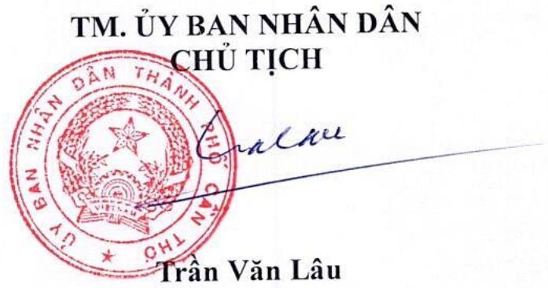

Số 70/KH-UBND

Cần Thơ, ngày 15 tháng 9 năm 2025

# KẾ HOẠCH Thực hiện công tác dân vận và đã thành phố Cần Thơ từ nay đến

Thực hiện Luật Thực hiện dân d Luật sửa đổi, bổ sung một số đó Công đoàn, Luật Thanh niên và năm 2025 và Chỉ thị số 33/CT Chính phủ về tiếp tục tăng cườn chính nhà nước, chính quyền cácác

Ủy ban nhân dân thành phố Cần Thơ Hội dân vận và dân chủ ở cơ sở trên đó 2025, cụ thể như sau:

# I. MỤC ĐÍCH, YÊU CẦU

# 1. Mục đích

- a) Đổi mới, nâng cao hiệu quả công chính nhà nước, chính quyền các trương, đường lối của Đảng, hiện tốt Luật Thực hiện dân ch Luật Mặt trận Tổ quốc Việt Nam hiện dân chủ ở cơ sở; Chỉ thị số xã nhận thức, hành động về công tác có thống chính trị;

b) Phát huy vai trò của Nhân dân quyền trong sạch, vững mạnh; phát yêu nước hướng tới Đại hội Đầu biểu toàn quốc lần thứ XIV của Đầu Bộ Chính trị về đẩy mạnh học tập và l Chí Minh

# 2. Yêu cầu

a) Xác định rõ vai trò, trách nhiện quan, tổ chức, đội ngũ cán bộ, cổ thực hiện dân chủ góp phần có - nước; xây dựng, nhân rộng c sở, tạo sự đồng thuận và tham gia Nhân dân đối với Đảng, Nhà nước

B) Triển khai thực hiện phải đồng đơn vị, địa phương; thường xuyên đảm bảo thực hiện nghiêm túc, công điều kiện cụ thể của từng cơn

C) Việc thực hiện công tác dân vận đạo, chỉ đạo của cấp ủy đảng, ch đảm bảo có sự kế thừa kết quả ông

# II. NỘI DUNG

1. Tăng cường sự lãnh đạo của cấp vận chính quyền, thực hiện

a) cấp ủy, chính quyền, cơ quan nam khai thực hiện có hiệu quả các ngac tác có liên quan, bảo đảm chính suốt, phục vụ người dân và doan xã kinh tế - xã hội, tổ chức tốt đại hê

6 b) Tiếp tục quán triệt, triển khai t chính sách, pháp luật của Nhà nội tình hình mới gắn với nhiệm vụ THẦN NGHỊ QUYẾT SỐ 25-NQ/TW Trung ương Đảng về tăng cường tác dân vận trong tình hình minh 2015 của Ban Bí thư về nâng cao các cấp; Quyết định số 23-QĐ về việc ban hành Quy chế công 33/CT-TTg; Luật Thực hiện dân của Luật Mặt trận Tổ quốc Việt Thực hiện dân chủ ở cơ sở; người năm 2024 của Hội đồng nhân dân đảm thực hiện dân chủ ở cơ sở trị vị, địa phương xây dựng kế hoa vận khéo? năm 2025 theo hướng cu thể:

Cơ quan thực hiện: Các cơ quan, đơn

Thời gian thực hiện: Thường

2. Ban hành văn bản phân công viên chức tham mưu thực hiện đơn vị, địa phương sau sắp xếp phù

a) Cơ quan thực hiện: Các cơ quan, đơn b) Thời gian thực hiện: Hoàn thành

3. Rà soát lại các văn bản của Đáo tỉnh hậu giang và tỉnh sóc Trăng cơ sở để điều chỉnh thay thế triển quan, đơn vị, địa phương sau sắp

a) Cơ quan chủ trì: sở nội vụ; b) cơ quan phối hợp: các cơ đư c) Thời gian thực hiện: Hoàn thành tr

4. Tiếp tục triển khai thực hiện thắng Nghị quyết Đại hội Đảng các cấp mạnh các phong trào thi đua y 2025 - 2030 và Đại hội đại biểu triển kinh tế - xã hội 5 năm (2021 năm 2025. Thực hiện tốt các chính chính sách, đồng bào các dân tộc xa, góp phần nâng cao đời sống

- a) Cơ quan chủ trì: Sở Dân tộng   
6 b) Cơ quan phối hợp: sở Nội vụ, các   
C) Thời gian thực hiện: Thường

5. Nâng cao hiệu quả công tác tiến xã công tác dân vận, thực hiện dân chu kịp thời những kiến nghị, nguyện đúng quy định pháp luật; tăng đôn đốc, hướng dẫn việc triển khai chủ ở cơ sở, cụ thể:

a) a) Cơ quan chủ trì: Thanh tra thành phố   
6 b) Cơ quan phối hợp: Sở Nội vụ, các   
- chạc) Thời gian thực hiện: thườ

6. Thường xuyên giáo dục chính vai trò gương mẫu của cán bộ, có, dựng và thực hiện tốt văn hóa công dân, nhất là cán bộ, công chức, viên dân; tăng cường kỷ luật, kỷ cuốc thanh tra công vụ, xử lý nghiên pháp luật, có hành vi cửa quyền lợi ích chính đáng của Nhân dân kiến thức pháp luật về công tác dâ tượng được giao theo dõi, phụ trá

a) cơ quan chủ trì: sở nội vụ;

4

16 b) Cơ quan phối hợp: Các cơ quan, định

Z. Tổ chức triển khai thực hi hành chính nhà nước giai đoạn 15 tháng 7 năm 2021 của Chính phủ 7 năm 2025 của Uy ban nhân dân chính năm 2025, cụ thể:

a) Cơ quan chủ trì: sở nội vụ;

B) Cơ quan phối hợp: Các cơ quan,

C) Thời gian thực hiện: Năm 2

8. Chủ động phối hợp, tạo điều kiên các cấp thực hiện tốt công tác tuyết thuận trong việc thực hiện các chủ phản biện xã hội, góp ý xây dựng chỉ

Xã a) Cơ quan thực hiện: Các cơ quan, ông Có b) Thời gian thực hiện: Thường

# III. KINH PHÍ THỰC HIỆN

1. Kinh phí thực hiện kế hoạch nam nước theo phân cấp ngân sách họchọ nguồn khác theo quy định

2. Các cơ quan, đơn vị, địa phương hiện nhiệm vụ cụ thể quy định trị ngân sách nhà nước, báo cáo cơ quy pháp luật hiện hành

# IV. TỔ CHỨC THỰC HIỆN

1. Các sở, ban ngành thành phố nghiệp nhà nước đóng trên địa bản cứ chức năng, nhiệm vụ được hiện nghiêm túc Luật Thực điều của Luật Mặt trận Tổ quốc Luật Thực hiện dân chủ ở cơ sở Căn cứ tình hình thực tế của cơ hiện công tác dân vận và dân chính cáo kết quả thực hiện gửi về Sở

2. Sở Tài chính phối hợp các cơ có đối khả năng ngân sách của thành phố trí kinh phí thực hiện kế hoạch thế

3. Sở Nội vụ theo dõi, giám sát, khác công tác dân vận và dân chủ ở có và nhân dân thành phố theo quyền

4. Đề nghi ủy ban mặt trận Th Nội vu và các sở, ngành, địa

Trên đây là Kế hoạch thực hiện củai địa bàn thành phố Cần Thơ từ n nếu có khó khẳn, vướng mắc, các Nội vụ tham mưu Uy ban nhân

# Nơi nhận:

- Bộ Nội v   
- TT.TU, TT.HĐNDTP;   
CT, các pct ubndtp   
UBMTTQVNTP   
- Ban TG&DVTU;   
Sở, Sở, ban ngành thành phố;   
- Đơn vị sự nghiệp thành phố   
- Cơ quan, đơn vị TW trên định - UBND xã, phường;   
- Cổng TTĐTTP;   
- VP UBNDTP (2,3);   
- Lưu: VT (VDuần). 8.

